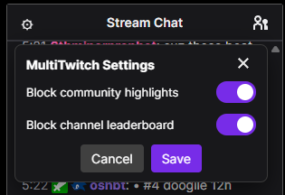
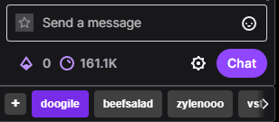

# Multitwitch Enhancer

**Enhanced Multitwitch.tv experience with custom tab navigation and cleaner Twitch chat.**

## Features

- **Custom Tab Selector** - Navigate between chat channels with smooth scrolling carousel
- **Channel Suggestions** - Smart autocomplete when adding/renaming channels
- **Clean Chat** - Remove community highlights and leaderboards from Twitch chat
- **Keyboard Navigation** - Tab through channels, use arrow keys to scroll

## Installation

1. Install [Tampermonkey](https://chromewebstore.google.com/detail/tampermonkey/dhdgffkkebhmkfjojejmpbldmpobfkfo?hl=en-US&utm_source=ext_sidebar) for Chrome

2. Click here to install the script: [multitwitch.user.js](https://github.com/Blake-goofy/multitwitch-mod/raw/refs/heads/main/multitwitch.user.js)

3. Click the **Raw** button when viewing the script, and Tampermonkey will prompt you to install it

That's it! Visit [multitwitch.tv](https://multitwitch.tv) and enjoy.
